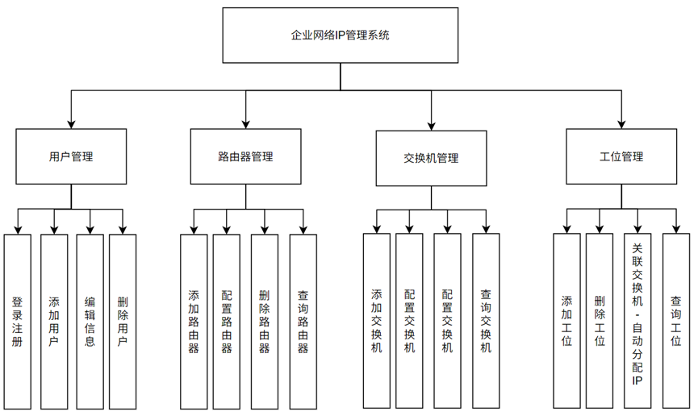
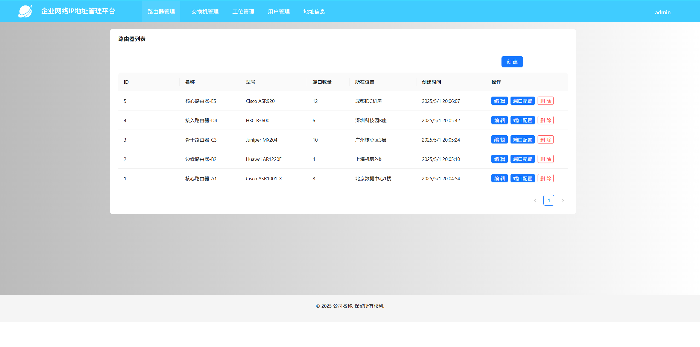
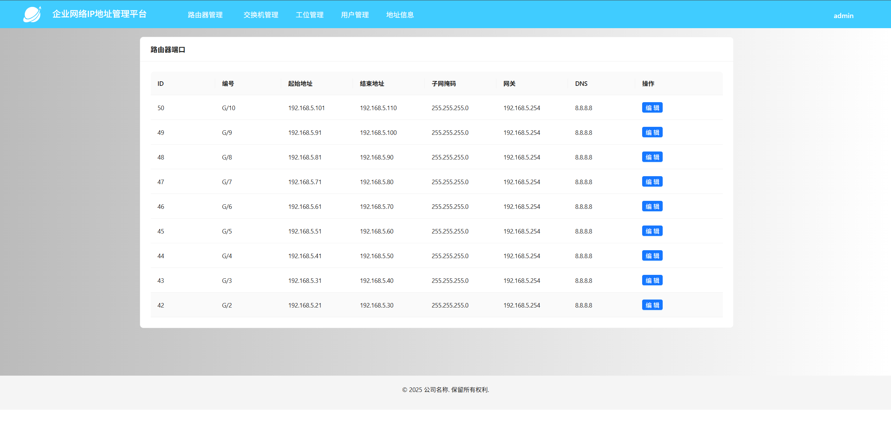
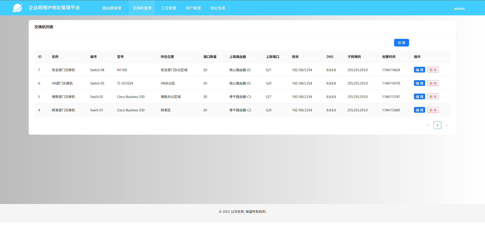
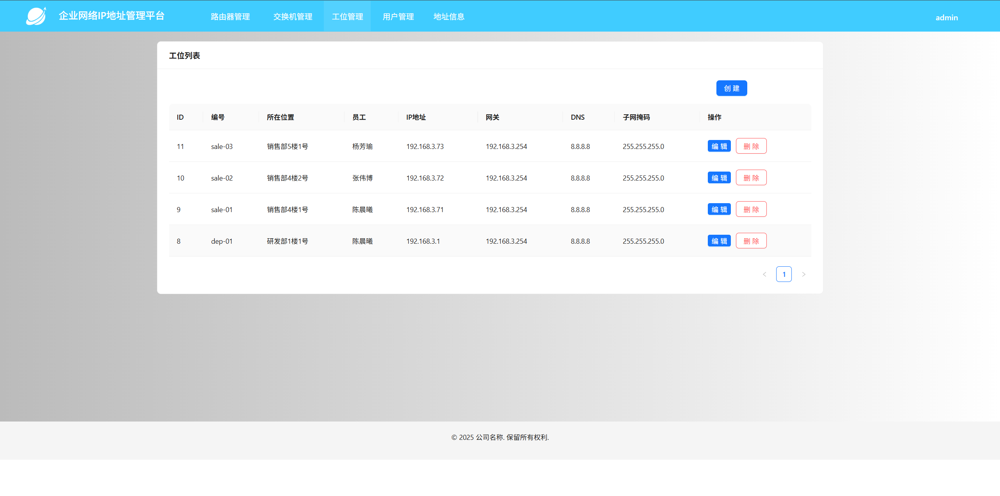
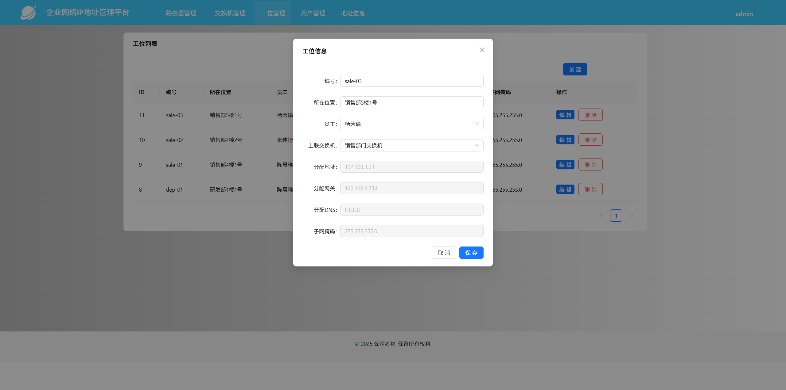
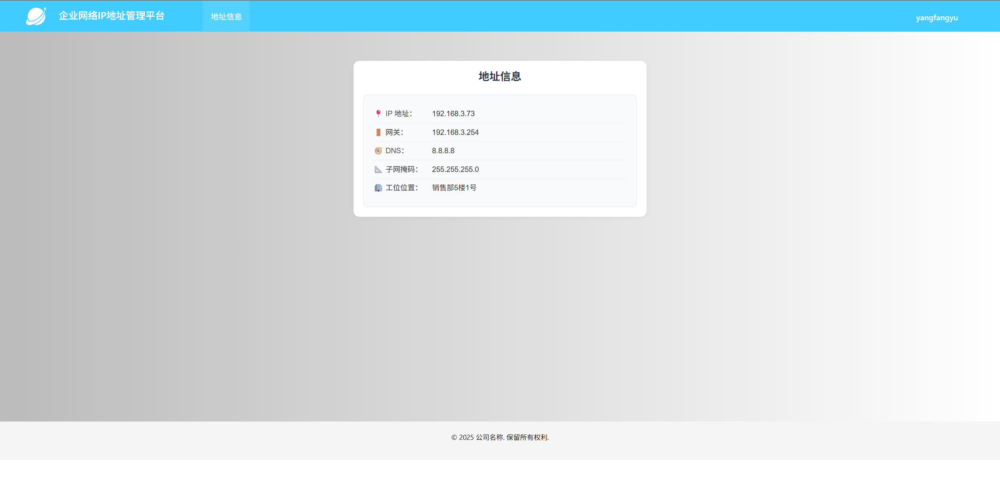
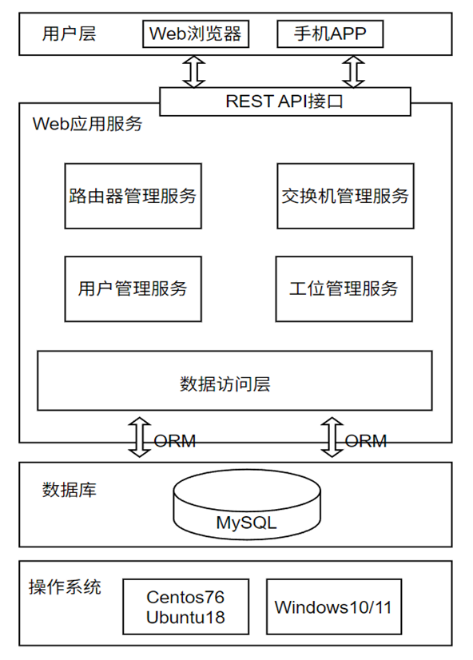
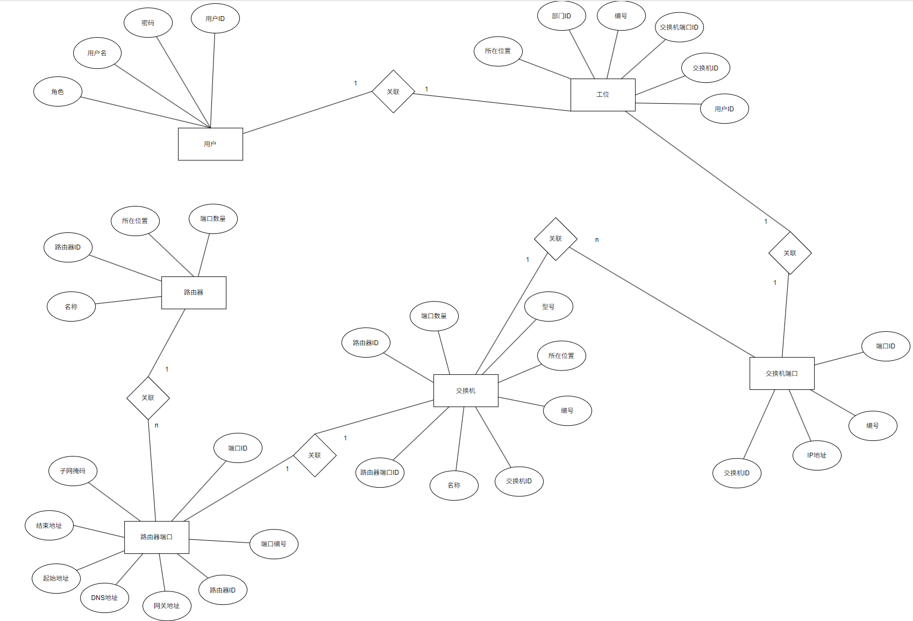

# 企业网络IP地址管理平台

## 项目介绍

企业内部管理IP地址的平台，便于网络管理员合理分配IP地址，提高工作效率and减少IP地址浪费。

后端地址：https://github.com/Chaim16/ip_distribution    
前端地址：https://github.com/Chaim16/ip_distribution-web

## 主要功能

1. 用户管理：登录/注册
2. 路由器管理：录入路由器信息，配置路由器端口（DNS、网关、掩码、起始地址、结束地址等）
3. 交换机管理：录入交换机信息，上联路由器端口
4. 工位管理：录入工位信息，上联交换机（自动分配可用IP地址）

## 角色划分

- 普通用户：查看分配的IP地址、网关、DNS、掩码、工位位置
- 管理员：路由器管理、交换机管理、工位管理、用户管理

## 技术栈

前端

- Vue.js: 3.2.13
- Ant Design Vue: 4.2.6
- axios: 1.7.9
- vuex: 4.0.0
- 开发环境：Node 18.16.0

后端

- Python: 3.11.11
- Django: 4.2.0
- Django Rest Framework：3.14.0
- Django Rest framework simple JWT：5.4.0
- Swagger: 1.21.8
- MySQL：8

## 界面

路由器管理界面

路由器端口配置界面

交换机管理界面

工位管理界面

分配IP地址界面

普通用户查看IP地址界面

## 总体架构

## 数据库设计-ER图

